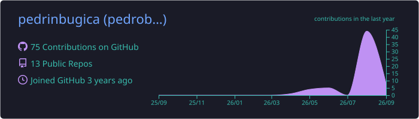
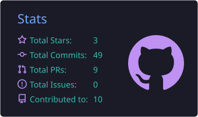
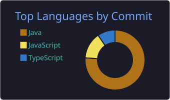

<!-- ===================== CABEÇALHO ===================== -->

  

  

  
  

---

### 👨‍💻 Sobre mim

Sou desenvolvedor full stack de **Maringá – PR**. Construo aplicações web completas, da interface ao banco de dados, com **Java + Spring Boot** e **React + TypeScript**, e gosto de integrar IA para automatizar o que antes era feito na mão.

- 🔭 Atualmente em **estágio de desenvolvimento**, criando módulos com Java e AngularJS
- 🎓 Cursando **Análise e Desenvolvimento de Sistemas (ADS)**
- 📚 **22+ cursos técnicos** concluídos em programação e tecnologia
- 🌱 Estudando agora: **Spring Boot a fundo, Docker e PostgreSQL**
- 💼 Experiência anterior com **Grupo Raizato** e **Poimenika**

---

### 🛠️ Tecnologias

  
    
  

  
  

### 🤖 IA & Automação

  
  
  

---

### 📊 GitHub Stats

  

  
  

  

---

<!-- ===================== RODAPÉ ===================== -->

  

